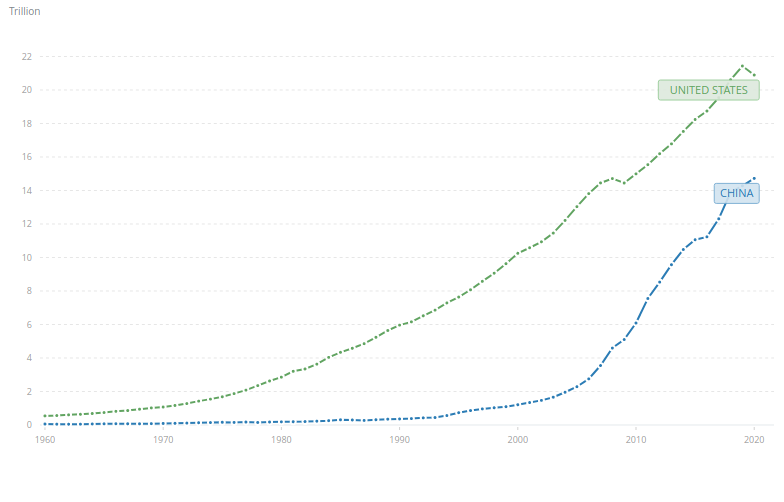
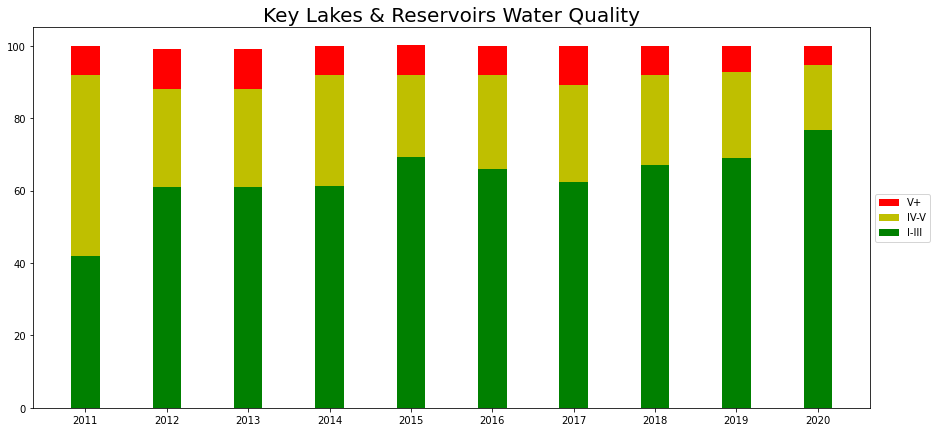
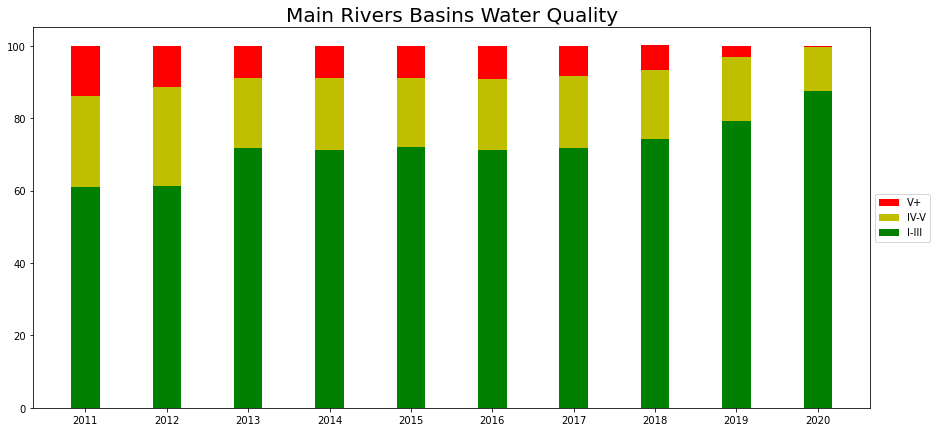
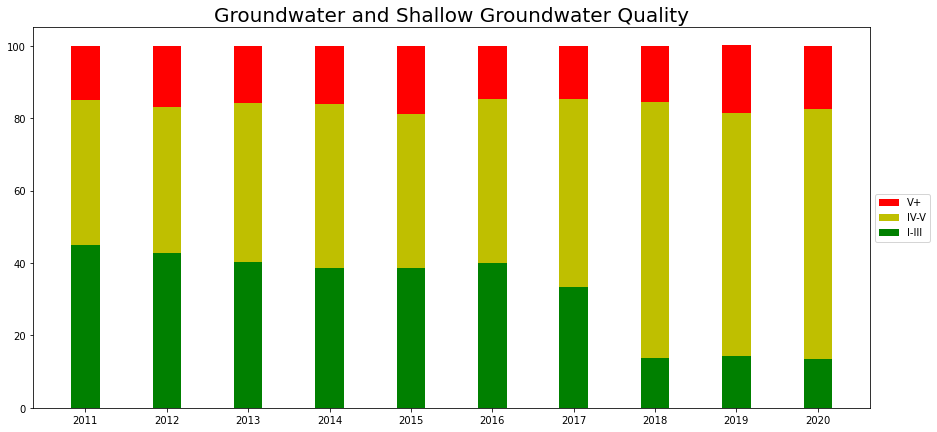
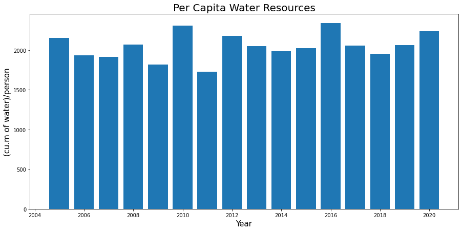
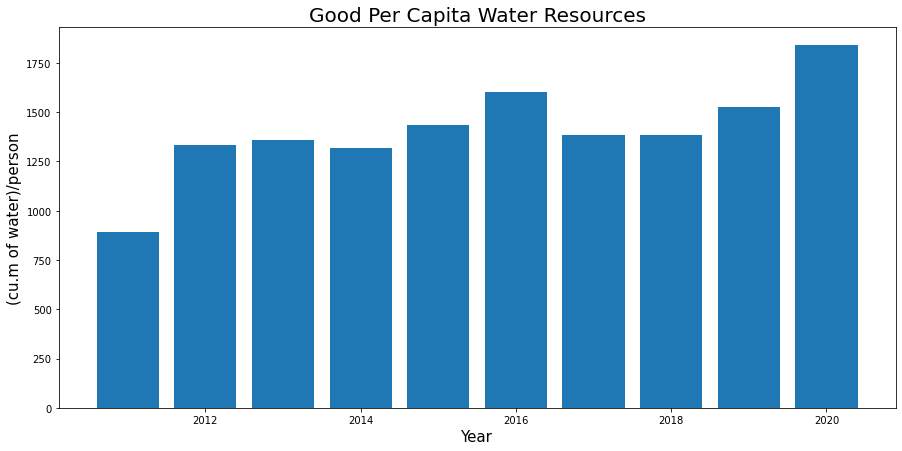
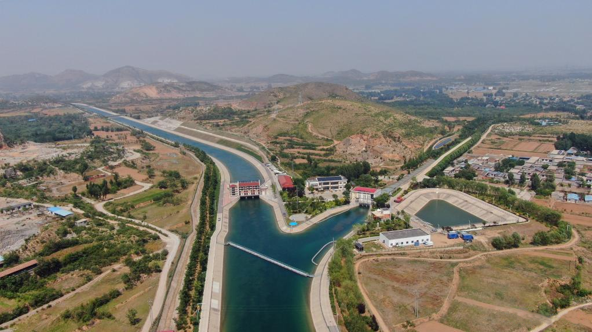
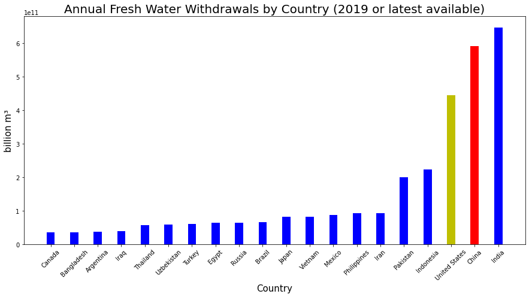
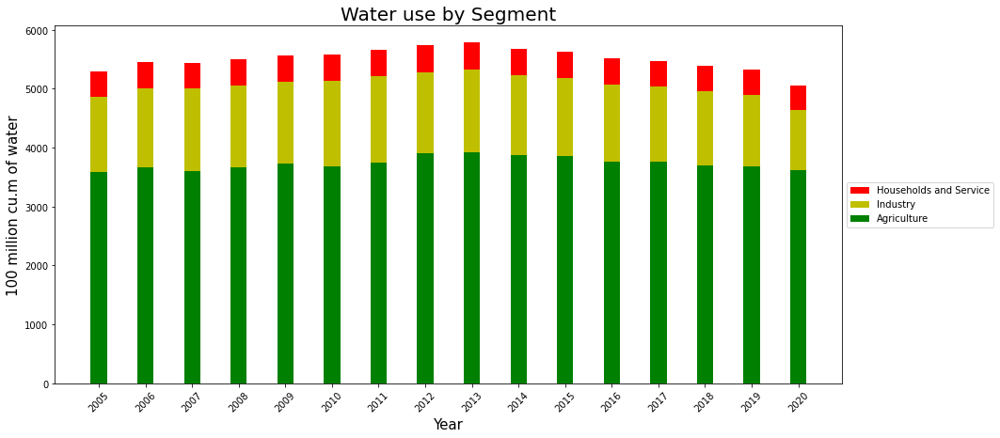
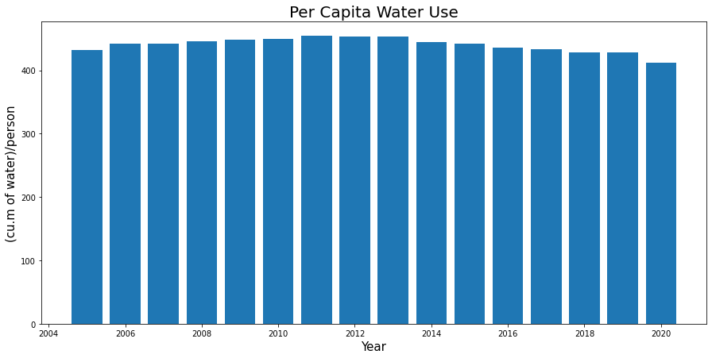

# A Primer On Water Scarcity In China

## Introduction

If you are anything like me, you have heard a lot of murmuring about water scarcity in China. Yet, you may never have had the time to dig into the matter. Water is a huge topic, from its size covering around 71 percent of the earth, to being an absolute requirement of life. This article will by no means cover the entirety of the effects of water scarcity in China, but it is a good jumping-off point for the topic.

China has a lot fewer freshwater resources relative to its size and population than the United States. The population of China is ~18% of the world's population while they only have ~7% of the world's freshwater resources.  Per capita, China has 2029m³ of water vs the United States having 8867m³. Along side the scarcity of water in China, it is not evening distributed geographically. The majority of the water is located in the South, while the majority of the population is located in the North. On the global scale China is far better off then many countries. Kuwait has no permanent lakes or rivers, Bahrain has only 23m³, Egypt 35m³, Sudan 110m³ of water per capita.

China has had an extreme focus on economic growth. This has come at a great cost, specifically water resources. This has led to the building of dams, water diversion projects, and the use of groundwater at unsustainable rates. The Three Gorges Dam, for example, has impacted the environment and specifically water resources in many ways. The reservoir behind the dam has displaced 1.24 million people. The dam has also led to changes in the sediment and water flow of the Yangtze River, which has impacted agriculture and the fishing industry.

Chart from the [World Bank](https://data.worldbank.org/indicator/NY.GDP.MKTP.CD?locations=CN-US)

The grow-or-die mentality of China historically led to the poor steward of its water resources. In 2009 only 23% of the water in lakes and reservoirs was suitable for domestic use, while 35% of the water was not even usable for industrialist uses. China has proven time and time again that it can make massive changes that would be impossible for most governments and peoples.

The grow-or-die mentality of China historically led to the poor steward of its water resources. In 2009 only 23% of the water in lakes and reservoirs was suitable for domestic use, while 35% of the water was not even usable for industrialist uses. China has proven time and time again that it can make massive changes that would be impossible for most governments and peoples.

In response to water scarcity and the incredible pollution, China put in place several policies:

* In 1988, China adopted ["Water Law"](http://www.lmcwater.org.cn/knowledge_sharing/water_policy/chn/202008/t20200827_162742.html) for "the purposes of rationally developing, utilizing, conserving and protecting water resources, preventing and controlling water disasters, bringing about sustainable utilization of water resources, and meeting the need of national economic and social development. ". The Water Law was revised in 2002 and amended in 2009.
* In 1984, China adopted the ["Law of the People’s Republic of China on Water and Soil Conservation"](http://www.lmcwater.org.cn/knowledge_sharing/water_policy/chn/202008/t20200827_162743.html) is "formulated for the purposes of preventing and controlling soil erosion, protecting and rationally using water and soil resources, mitigating flood, drought and sandstorm disasters, improving the ecological environment and protecting sustainable socio-economic development". Revised in 2010.
* In 1991, China adopted the ["Law of the People’s Republic of China on Prevention
and Control of Water Pollution"](http://www.lmcwater.org.cn/knowledge_sharing/water_policy/chn/202008/t20200827_162745.html) is "formulated for the purposes of preventing and controlling water pollution, protecting and improving the environment, safeguarding drinking water and promoting overall, balanced and sustainable development of the economy and society.". Amended in 2019 and 2015.
* In 2014, China adopted ["The Regulations on Administration of Supply and Use of Water from the
South-to-North Water Diversion Project"](http://www.lmcwater.org.cn/knowledge_sharing/water_policy/chn/202008/t20200827_162746.html) are "formulated for the purpose of strengthening
administration of supply and use of water from the South-to-North Water Diversion
Project and optimizing the economic, social and ecological benefits of the Project.".

Although the policies often did not work as intended and had secondary consequences, China seemingly has put an end to water pollution. Based on data provided by the National Bureau of Statistics of China and the CWR (China Water Risk) China has been largely successful in addressing pollution. China has built hundreds of water treatment facilities to clean up existing pollution.

Quick Note About Data: The data is provided by China specifically the National Bureau of Statistics of China. It has some questionable aspects, especially related to how they measured pollution levels. Some years, without any explanation, they changed what lakes and rivers they took measurements from. Other years they changed the number of measurements taken from each source. Given any source of data, you must always be aware of collection bias. I have pointed out one questionable aspect but there are many more that are less quantifiable.

From the [CWR](https://www.chinawaterrisk.org/) the definition of water grades:

* Grade I: suitable for source water and national natural reserve

* Grade II: suitable for domestic use (first rate), rare aquatic lives (and some other uses)

* Grade III: suitable for domestic use (second rate) (and some other uses)

* Grade IV: suitable for industrial use and entertainment use (without contact with human)

* Grade V: suitable for agricultural use

* Grade V+: not suitable for any use

Lake, Reservoirs, River river basins have all had significant improvements in the pollution levels. The amount of water that qualifies for domestic use increased 30-40% and continue to head in  a good direction.

The groundwater has continued to deteriorate in quality even given the policy focused on reducing water pollution. There are many potential reasons why groundwater quality may be deteriorating, even despite policy efforts to reduce water pollution. Possible reasons include:

* Groundwater recharge areas are being polluted, for example from agricultural or industrial runoff;
* Groundwater is becoming contaminated from septic tanks or other sources of wastewater;
* Excessive pumping of groundwater can lower groundwater levels and increase the chances that pollutants will come into contact with water sources.

How much does addressing water pollution help China with water scarcity? We can use the water quality metrics to adjust the water resources per capita numbers into good water per capita. Recall from earlier that China has 2,029m³ per capita.

2,029m³ per capita is above the accepted definition of water scarcity.

* Water stress 1,700m³
* Water scarcity 1,000m³
* Water acute scarcity 500m³

Based only on this number China water scarcity looks pretty good. Now let's consider the water resources adjusted for pollution.

Now we get a very different picture of actual available water per capita. In 2011 water resources per capita were approaching actual scarcity. The clean-up of the pollution has broth water resource from actual scarcity above water stress levels. This delivers a very good improvement in water scarcity just from addressing pollution.

It is important to realize that this water is not located where it is needed, so people living in the big Northern cities like Beijing are still experiencing actual water scarcity, with water resources per capita in 2020 at 117.8m³. Tianjin is the worst, 96m³ per capita in water resources. On the other hand, Jiangxi, which is further south, has 3,731m³ per capita. Yet the economic forces keep people moving to industrialized northern city regardless of the poor stands of living.

### 2: The North to South Water Diversion Project

Speaking of water not being located where it is needed and the big northern cities, this is a good time to briefly bring up the South to North water diversion project. The South to North water diversion project was conceived in 1952, after Mao Zedong said "Water in the south is abundant, water in the north scarce. If possible, it would be fine to borrow a little.". Mao Zedong, the man who is the architect of the world's deadliest famine, partly due to the unproven agricultural practices he forced farmers to adopt as part of his Great Leap Forward. As Moa indicated, 80% of the water in China is located in the south while the greater part of the population lives in the north. The industrialization of China has only increased the trend of people moving from the west of China to large Eastern cities, such as Beijing. The growing population in the North-East parts of China has exacerbated the lack of water. This lack has led to the world's largest water relocation project in history. If completed the project would divert ~45 billion m³ of water annually from four major rivers: Yangtze, Yellow River, Huaihe, and Haihe. From 2014 to 2021 the project has diverted ~50 billion m³ of water, supplying 70-80% of the water consumed in Beijing and the neighboring provinces. This has allowed Bejing to continue to grow and increase production, but as just discussed, in Beijing water per capita is still in the actual water sacristy levels. Even efforts at this scale can not keep up with the growing population and increasing demand for industrial processes. The project is expected to take another 40-50 years to complete. Diverting water is costly, estimated to cost 500 billion yuan (~80 billion U.S. dollars). Given the current multi-trillion scope of government spending, this no longer seems like that much money. It's not clear the South to North water diversion project was a good choice, but it demonstrates the extent that China is willing to go.

## Section Title

So far we have discussed major initiatives that China has done to deal with water scarcity. Yet even as they make more water resources available, they consume them in the creation of continuous growth. China is the world’s second largest user of water resources behind India.

China has exerted enormous efforts to improve the quality and availability of water. Alongside these efforts, China has created policies to reduce the usage of water. [China Water Conservation Project](https://en.ndrc.gov.cn/policies/202105/t20210521_1280514.html)

Agriculture is the largest use of water in China, so not surprisingly a lot of the policy has centered around Agriculture. The policy has included changes in water arrogation technology, increasing the number of water-efficient crops, decreasing the number of areas zoned for agriculture, and much more.

Policies have also been put in place to decreases industrial water usage. Industrial water usage includes power generation. One extremely prominent policy was banning Bitcoin mining in China. Mining BTC was estimated to consume 1% of China's electricity. Electricity production uses a lot of water, a coal-fired power plant uses about 12 million gallons of water per hour. This does not include the water used for the "Coal Washing" part of the mining process of coal. Nuclear power plants use smiler qualities of water in the production of electricity to coal-fired power plants. The scarcity of water in China has caused a scarcity of electricity forcing China to implement policies that limit the use of electricity. The limitations on power and water usage have had impacts on Chinas industry. China has halted the production of key suppliers to Apple and Tesla until they were able to decreases the power requirement of manufacturing. The halts incurred stalls in the manufacturing of Apple and Tesla due to the lack of supplies. Given the high visibility of affecting Apple and Tesla, these were not the first manufacturers to have electrical power efficiency requirements placed open them.

China has simultaneously increased the number of people with access to freshwater while decreasing the usage of the water.

By the end of 2019, "more than 40,000 projects had been implemented as part of efforts to build sponge cities, utilizing 350 million tonnes of rainwater annually." [http://www.xinhuanet.com/english/2021-05/13/c_139943703.htm]

Dams

Water is a constraint on China, and a constraint on the world
