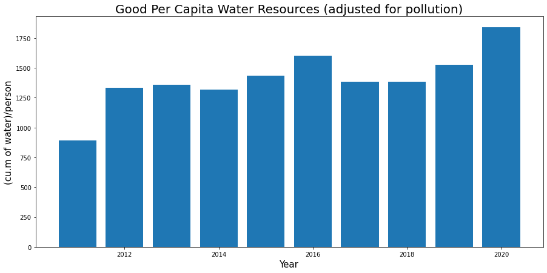

# A Primer On Water Scarcity In China

## Introduction

If you are anything like me you have heard a lot of roomers about China having a water shortage. Yet never had the time to dig into the truth of the matter. After spending the last week reading research reports and exploring data, I believe China does have a water problem, but what has been written in click bat arctics have is misleading (yea duh). Even the majority of the research reports that are publicly available are out of date. The picture you will get from reading the results returned by Google would lead you to believe that China is crumbling at the seams due to a lack of water. The data, admittedly largely provided by China, does not support imitate catastrophic collapse of China due to water sacristy. Rather, the data shows China is being constrained by the sacristy of water and the constraint of water sacristy is not limited to China.

## Outing the Water Problem in China

China historically has been a poor steward of its water resources. In 2009 only 23% of the water in lakes and reservoirs was suitable for domestic use, while 35% of the water was not even usable for industrialist uses [china water risk]. The incredible extent of water pollution in China has been a compounding factor for water scarcity in China.

Beyond water pollution, China has a lot fewer freshwater resources relative to its size and population than the United States. The population of China is ~18% of the world's population while they only have ~7% of the world's freshwater resources. The water that China does have is not well distributed across China. The majority of the water is located in the South, while the majority of the population is located in the North.  

Making the matter even worse for China is the economic focus on exports and growth. China has held the mandate to be self-sufficient in energy, food, and minerals, but they have exceeded self-sufficiency in main areas. China is the world's large exporter of many agricultural products: Wheat, Rice, Cotton, Lettuce, Green Beans, Potatoes, Spinach, Pumpkin, Squash, Sweet Potatoes, Pears Grapes, Peaches, Apples, Pork, Lamb, Goats, Ducks, and a whole lot more. In addition to agricultural products, we are all very aware of how many of the physical goods we enjoy are created in China.

## China Addressing the Water Problem

### 1: Addressing Pollution

Based on data provided by the National Bureau of Statistics of China and the CWR (China Water Risk) addressing pollution has been Chinas greatest success. China has implemented major policy changes to address the pollution of water. Both focused on addressing the causes of population and cleaning up the already polluted water. China has built hundreds of water treatment facilities to clean up existing pollution. One of the largest pollutants is run of pesticides and fertilizers, so China has required farmers to create buffer zones between the crops and bodies of water. Many similarly drastic efforts have been implemented by China to address water pollution. The data below show the success of the policies.

* Grade I: suitable for source water and national natural reserve

* Grade II: suitable for domestic use (first rate), rare aquatic lives (and some other uses)

* Grade III: suitable for domestic use (second rate) (and some other uses)

* Grade IV: suitable for industrial use and entertainment use (without contact with human)

* Grade V: suitable for agricultural use

* Grade V+: not suitable for any use

Lake, Reservoirs, River river basins have all had significant improvements in the pollution levels.

The groundwater has continued to deteriorate in quality even given the policy focused on reducing water pollution.

How much does addressing water pollution help China with water scarcity? We can use the water quality metrics to adjust the water resources per capita numbers into good water per capita. Here we have China's water resources per capita. These numbers look great. Accepted definitions of water stress/scarcity and acute scarcity are respectively 1,700m3, 1,000m3, and 500m3per person per year for all uses, direct and indirect. Based on those measures it looks pretty good, now let's consider the water resources adjusted for pollution.

Now we get a very different picture of actual available water per capita. In 2011 water resources per capita were approaching actual scarcity. The clean-up of the pollution has broth water resource from actual scarcity above water stress levels.

It is important to realize that this water is not located where it is needed, so people living in the big Northern cities like Beijing are still experiencing actual water scarcity.

### 2: The North to South Water Diversion Project

Speaking of water not being located where it is needed, this is a good time to briefly bring up the South to North water diversion project. The South to North water diversion project was conceived in 1952, after Mao Zedong said "Water in the south is abundant, water in the north scarce. If possible, it would be fine to borrow a little.". Mao Zedong, the man who is the architect of the world's deadliest famine, paltrily due to the unproven agricultural practices he forced farmers to adopt as part of his Great Leap Forward. As Moa indicated, 80% of the water in China is located in the south while the greater part of the population lives in the north. The industrialization of China has only increased the trend of people moving from the west of China to large Eastern cities, such as Beijing. The growing population in the North-East parts of China has exacerbated the lack of water. This lack has led to the world's largest water relocation project in history. If completed the project would divert ~45 billion cubic meters of water annually from four major rivers: Yangtze, Yellow River, Huaihe, and Haihe. From 2014 to 2021 the project has diverted ~50 billion cubic meters of water, supplying 70-80% of the water consumed in Beijing and the neighboring provinces. In Beijing water per capita is still in the actual water sacristy levels. Even efforts at this scale can not keep up with the growing population and increasing demand for industrial processes. The project is expected to take another 40-50 years to complete. Diverting water is costly, estimated to cost 500 billion yuan (~80 billion U.S. dollars). Given the current multi-trillion scope of government spending, this no longer seems like that much money. It's not clear the South to North water diversion project was a good choice, but it demonstrates the extent that China is willing to go.

### 3: Reduction of Usage Through Policy

China has exerted enormous efforts to improve the quality and availability of water. Alongside these efforts, China has created policies to reduce the usage of water. [China Water Conservation Project](https://en.ndrc.gov.cn/policies/202105/t20210521_1280514.html)

Agriculture is the largest use of water in China, so not surprisingly a lot of the policy has centered around Agriculture. The policy has included changes in water arrogation technology, increasing the number of water-efficient crops, decreasing the number of areas zoned for agriculture, and much more.

Policies have also been put in place to decreases industrial water usage. Industrial water usage includes power generation. One extremely prominent policy was banning Bitcoin mining in China. Mining BTC was estimated to consume 1% of China's electricity. Electricity production uses a lot of water, a coal-fired power plant uses about 12 million gallons of water per hour. This does not include the water used for the "Coal Washing" part of the mining process of coal. Nuclear power plants use smiler qualities of water in the production of electricity to coal-fired power plants. The scarcity of water in China has caused a scarcity of electricity forcing China to implement policies that limit the use of electricity. The limitations on power and water usage have had impacts on Chinas industry. China has halted the production of key suppliers to Apple and Tesla until they were able to decreases the power requirement of manufacturing. The halts incurred stalls in the manufacturing of Apple and Tesla due to the lack of supplies. Given the high visibility of affecting Apple and Tesla, these were not the first manufacturers to have electrical power efficiency requirements placed open them.

China has simultaneously increased the number of people with access to freshwater while decreasing the usage of the water.

By the end of 2019, "more than 40,000 projects had been implemented as part of efforts to build sponge cities, utilizing 350 million tonnes of rainwater annually." [http://www.xinhuanet.com/english/2021-05/13/c_139943703.htm]

Dams

Water is a constraint on China, and a constraint on the world
