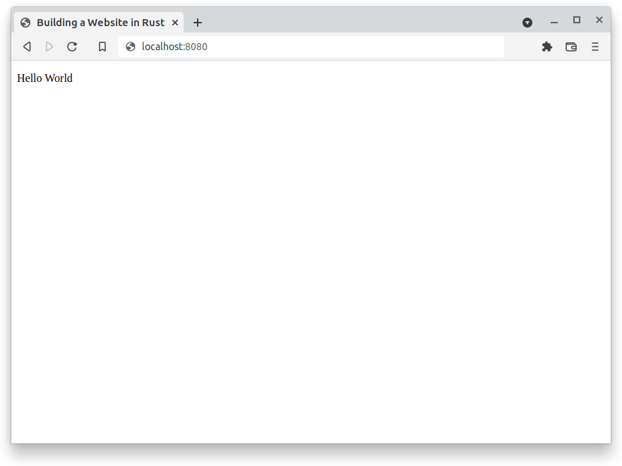

# Part 1: Building a WebSite in Rust Using Rocket and Yew

Created: 02/01/2022

Simple Rust website with a Yew frontend that interacts with a rocket backend.

View the code for part 1 on [GitHub](https://github.com/nmharmon8/Rust_Rocket_Yew_Tutorial/tree/main/part1)

If you have an issue following the tutorial create an issue on the [GitHub](https://github.com/nmharmon8/Rust_Rocket_Yew_Tutorial).

Looking for [Part 2](/posts/rust_rocket_yew_part2.md)?

## Rust Technology Stack

### Backend

* Rocket Version 0.50-rc.1
* serde 1.0.133

### Frontend

* yew = "0.19.3"
* yew-router = "0.16.0"
* wasm-logger = "0.2.0"
* web-sys = "0.3.56"
* pulldown-cmark = "0.9.1"
* log = "0.4.14"
* reqwasm = "0.4.0"
* serde = "1.0.133"

### Common Library

* serde = "1.0.133"

## Setting Up Rust Development

I highly recommend doing all development in Docker. Checkout [Rust Web Development In Docker](/posts/rust_rocket_yew_development_in_docker.md)

If you already have rust installed we will be using Trunk along with the build target of wasm32-unknown-unknown.

Browsers don't know how to execute rust binaries, so Trunk will be used to build the frontend code into something a browser understands(WebAssembly). Trunk is somewhat like a rust equivalent of webpack. Trunk requires the additional build target of WebAssembly.

`If you used the docker setup referenced above this step is already completed.`

```bash
cargo install trunk
rustup target add wasm32-unknown-unknown
```

## To the Code

We are going to have three rust projects (backend, frontend, and common).

* The backend will serve the files.
* The frontend will have all the logic and rendering capabilities.
* The common will have the data structures that will be passed between the frontend and backend.

We will start with a root project folder:

```bash
mkdir rust_website_tutorial
```

Create the three component project temples using cargo:

```bash
cargo new backend --bin
cargo new ui --bin
cargo new common --lib
```

Both the backend and frontend are created with the bin flag while the common is just a library. Library meaning it is not executable.

Now we will link all the projects into a single workspace by adding a Cargo.toml at the root level.

___
rust_website_tutorial/Cargo.toml

```bash
[workspace]

members = [
  "ui",
  "backend",
  "common",
]
```

___

We will start by create the backend using Rocket. Rocket is a webserver written in rust. A lot of rust libraries are changing very fast, so if you don't use the same version as the tutorial the library interface may have changed. Rusts build system makes matching version very easy, so it will be easy to replicate the tutorial.

Start by adding the dependency:

___
rust_website_tutorial/backend/Cargo.toml

```bash
[package]
name = "backend"
version = "0.1.0"
edition = "2021"

[[bin]]
name = "web"
path = "src/main.rs"

[dependencies]
#This is the our common library that we will create
common = {path = "../common"}
#Rocket a rust web server
rocket = {version = "0.5.0-rc.1", features = ["json"]}
#A rust serialization library for interacting between the backend and frontend
serde = "1.0.133"
```

___

You will notices that version of every library was specified.

Now that you have specified the dependencies we start writing code :)

We will start by severing the string `"Hello World"` to your browser.

This involves creating:

* Create a Route - function that matches the url in browser.
* Launching Rocket - starting the web server which is Rocket

___
backend/src/main.rs

```rust
//Import the rocket macros
#[macro_use]
extern crate rocket;

//This sets up a route. So when someone navigates to / it will call this function.
#[get("/")]
async fn index() -> String {
    String::from("Hello World")
}

// Finlay start the web sever using the launch macro.
#[launch]
fn rocket() -> _ {
    // You must mount the index route
    rocket::build()
        .mount("/", routes![index])
}
```

___

What did we just do? We started a webserver with a single route `/` that serves a string `Hello World`.

Lets run what we have written.

From the backend directory run:

```bash
cargo run
```

Navigate to localhost:8000 in you browser.


Congratulations you can now serve data using the rocket webserver 🎉.

Now we want to have something more interesting to sever then just a String. So lets create a frontend.

___

## Getting Started with Yew

Again we will start by adding the dependency, this time for the frontend:

___
rust_website_tutorial/ui/Cargo.toml

```bash
[package]
name = "ui"
version = "0.1.0"
edition = "2021"

[dependencies]
#Our common code library
common = {path = "../common"}
#The frontend framework we are going to use
yew = "0.19.3"
#Yew's routing framework for handling url on the frontend
yew-router = "0.16.0"
#Logging for Debugging
wasm-logger = "0.2.0"
log = "0.4.14"
#A WebAssembly bindgen
web-sys = "0.3.56"
#A rust library that renders markup as HTML
pulldown-cmark = "0.9.1"
#Reqwasm will be used to send request to the backend
reqwasm = "0.4.0"
#A rust serialization library for interacting data between the backend and frontend
serde = { version = "1.0.133", features = ["derive"] }
```

___

The frontend has a lot more dependencies then the backend. All the logic and data processing will be happing on the frontend. This is pretty cool, we just serve up a bunch of code and the user will do all the processing.

Now to the coding. We will create a Yew Component. A Component is interface that Yew provides for creating and managing the UI.

We will create a struct called App. For now we will just leave the App struct empty. Then we will implement the Component interface for the App struct. If you are coming from a different langue this is similar to creating a Class that inherits an interface.

Yew Components have two associated Types `Message` and `Properties`. We will use both later, but for now we will set Msg to and empty struct and Properties to None.

Yew Components also have two required methods `create` and `view`. Both do as their name would suggest. Along with the two required methods Components have additional provided methods one of which is `update`. We will also comeback to the purpose of `update` later on.

___

ui/src/main.rs

```rust
use yew::prelude::*;

//Create the main app that will load all other Components
pub struct App {
}

//Message enum that is used for managing the life cycle of Components
pub enum Msg {
}

//Implement the Component interface
impl Component for App {
    type Message = Msg;
    type Properties = ();

    //Create a new App
    fn create(_ctx: &Context<Self>) -> Self {
        App {
        }
    }

    fn update(&mut self, _ctx: &Context<Self>, msg: Self::Message) -> bool {
        false
    }

    fn view(&self, ctx: &Context<Self>) -> Html {
        //Creates The HTML that will show up in the browser.
        html! {
              <p> {"Hello World"} </p>
        }
    }
}

// Entry point for starting the Yew application
pub fn main() {
    //Create the logger
    wasm_logger::init(wasm_logger::Config::new(log::Level::Trace));
    //Start the Yew framework
    yew::start_app::<App>();
}
```

___

This rust code can't directly be executed in a browser like Javascript. So we need to build it into WebAssembly. But we also need an HTML file that links the WebAssembly, so we have something to serve to the browser.

Create a template HTML file. The HTML file will be filled in with the link to the complied WebAssembly by the build tool Trunk.
___
ui/index.html

```html
<!DOCTYPE html>
<html>

<head>
    <meta charset="utf-8" />
    <title>Building a Website in Rust
    </title>
</head>

<body>
</body>

</html>
```

___

The HTML generated by the Yew Component will be injected into the body section of the HTML.

Now we can build and serve the Yew frontend.

From rust_website_tutorial/ui/ run:

```bash
trunk serve
```

Navigate in your browser to localhost:8080



Yeah 🐣! We have again made a hello world, but we did it with way more code. Soon the power of Yew will become evident.

You will notice that Yew created a dist directory under the ui/ project. This is where all the ui code is built into.
Take a peak at the dist directory especially the `index.html`. You can see that WebAssembly binaries have been built and linked into the HTML.

Somthing like:

```html
<link rel="preload" href="/index-ab147be7cd707491_bg.wasm" as="fetch" type="application/wasm" crossorigin="">
```

WASM is the aggravation for WebAssembly.

## Serve the Yew Front End Using Rocket Backend

So now we need to update are backend so that it can serve the Yew frontend.

Add some additional imports to the backend.

___

backend/src/main.rs

```rust
use rocket::fs::NamedFile;
use rocket::response::status::NotFound;
use std::path::PathBuf;
```

___

We need to serve all the file from the dist directory starting with the index.html file. The index.html file links other files in the dist directory, so we need a route that can match any file is the dist directory.

Change the index route to serve the contests of the dist directory.
___
backend/src/main.rs

```rust
// Return the index file as a Rocket NamedFile
async fn get_index() -> Result<NamedFile, NotFound<String>> {
    NamedFile::open("../ui/dist/index.html")
        .await
        .map_err(|e| NotFound(e.to_string()))
}

//Create a route for any url that is a path from the /
#[get("/<path..>")]
async fn static_files(path: PathBuf) -> Result<NamedFile, NotFound<String>> {
    let path = PathBuf::from("../ui/dist").join(path);
    match NamedFile::open(path).await {
        Ok(f) => Ok(f),
        Err(_) => get_index().await,
    }
}

// Return the index when the url is /
#[get("/")]
async fn index() -> Result<NamedFile, NotFound<String>> {
    get_index().await
}
```

Now add the now ```static_files``` route to the rocket build
backend/src/main.rs

```rust
#[launch]
fn rocket() -> _ {
    // You must mount the static_files route
    rocket::build()
        .mount("/", routes![index, static_files])
}
```

___

```#[get("/<path..>")]``` is a type safe way of creating a path route. If the browsers url is localhost:8000/index.html it will match this route and load the index.html from the dist directory. The dist index.html file will references other files in the dist directory which will also get loading using this route. You will also notice that if the path dose not match a file then the route will return the index.html file as default. This is important for the Yew router on the frontend to work properly. We will get to this later.

Once again from the backend run:

```bash
cargo run
```

Navigate your browser to localhost:8000/

If you look at the console output you will notice that a index...js and index...wasm file also matched the ```static_files``` route.

Finally, we will make it so the projects get built together. For this we will use a rust build script. Before the backend gets build we need to compile the frontend into WebAssembly and create a index.html file using Trunk.
___

backend/src/build.rs

```rust
use std::path::Path; 
use std::process::Command;

const FRONTEND_DIR: &str = "../ui";

fn main() {
    println!("cargo:rerun-if-changed={}/src", FRONTEND_DIR);
    println!("cargo:rerun-if-changed={}/index.html", FRONTEND_DIR);
    build_frontend(FRONTEND_DIR);
}

fn build_frontend<P: AsRef<Path>>(source: P) {
    Command::new("trunk")
        .args(&["build", "--release"])
        .current_dir(source.as_ref())
        .status()
        .expect("Failed to build Frontend");
}
```

___

Now when you run cargo run:

```rust
cargo run
```

The backend project it will build the Yew frontend using Trunk.

In [Part 2](/posts/rust_rocket_yew_part2.md) we will make more interesting frontend components and send data between the frontend and backend.

[Part 2](/posts/rust_rocket_yew_part2.md)

If you had issues don't forget to create issues on [GitHub](https://github.com/nmharmon8/Rust_Rocket_Yew_Tutorial)
