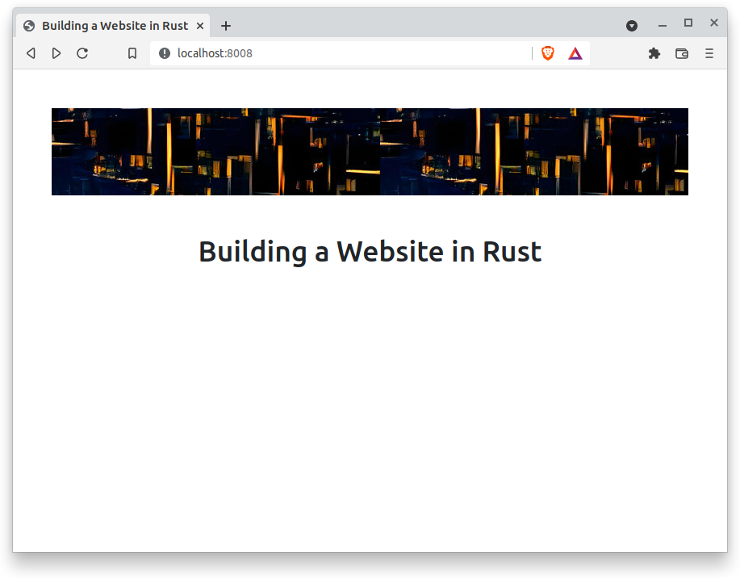

# Part 2: Building a WebSite in Rust Using Rocket and Yew

Created: 02/03/2022

Simple Rust website with a yew frontend that interacts with a rocket backend Part2.

If you missed Part1 [Part 1](/posts/rust_rocket_yew_part1.md).

View the code for part 2 on [GitHub](https://github.com/nmharmon8/Rust_Rocket_Yew_Tutorial/tree/main/part2)

Looking for [Part 3](/posts/rust_rocket_yew_part3.md).

## Part 2

We are going to add a banner, navigation bar, home page, and not found page.

## Perpetual Building

First off lets, save a bit of time. We are going to have the backend and frontend rebuild on change so at any time you can go take a peek at the progress we have made.

You can build only the frontend from the ui directory using:

```bash
trunk watch
```

`trunk watch` will watch the file system and rebuild the Yew frontend when a file is saved.

We can achieve the same outcome for the backend using cargo-watch.

```bash
cargo install cargo-watch
```

Then from the backend directory run:

```bash
cargo watch -x run
```

Now you can just leave both of these commands running in different terminals and the project will always stay built.

## Backend Data

The backend needs to be able to send the banner image to the frontend for display. We also are going to add the JavaScript/CSS Bootstrap styling library for making the navigation bar.

We will start by creating a directory with data we want to server to the frontend.

```bash
mkdir -p backend/data/images
mkdir -p backend/data/js
```

Now lets add this image to the image directory.

Save this image as backend/images/banner-background.jpg


Finlay, we are going to add Bootstrap Javascript so we can make things look good.

Download [Bootstrap v5.1](https://github.com/twbs/bootstrap/releases/download/v5.1.3/bootstrap-5.1.3-dist.zip)

Unzip into backend/data/js. After unzipping you should have backend/data/js/bootstrap-5.1.3-dist/...

Lets add routes to support serving all this sweet sweet data we just added.

Lets create a route to load all the file we just stuck into the data directory.
___
backend/src/main.rs

```rust
#[get("/data/<path..>")]
async fn data(path: PathBuf) -> Result<NamedFile, NotFound<String>> {
    let path = PathBuf::from("./data/").join(path);
    match NamedFile::open(path).await {
        Ok(f) => Ok(f),
        Err(_) => get_index().await,
    }
}
```

So any route that starts with /data will match and try and load a file from data. If the file is not in data then it will just return the index.html.

Don't forget to mount the route.

___
backend/src/main.rs

```rust
#[launch]
fn rocket() -> _ {
    rocket::build()
        .mount("/", routes![index, static_files, data])
}
```

That was easy 🙂.

## Link the JavaScript into the index.html

If we want to use Bootstrap Javascript for making everything visually appealing we need to link it in the index.html.

___
ui/index.html

```html
<!DOCTYPE html>
<html>
    <head>
        <meta charset="utf-8" />
        <title>Building a Website in Rust</title>
        <link rel="stylesheet" href="/data/js/bootstrap-5.1.3-dist/css/bootstrap.css" />
    </head>
    <body></body>
</html>
```

___

The link will match the /data route that we just added to the backend. The backend will load the js into the current scope when the index.html is loaded. This means any Bootstrap styling can now be used in the Yew Components.

## Making Cool Yew Components

Lets get to it and make some cool Yew Components.

We will start by adding a banner to the App Components that we made in [Part 1](/posts/rust_rocket_yew_part1.md).

Update the view function to paint the background with the banner image.
___
ui/src/main.rs

```rust
fn view(&self, ctx: &Context<Self>) -> Html {
        html! {
            <div class="justify-content-center m-5">
                <div class="container-fluid g-0" style="background-image: url('/data/images/banner-background.jpg'); height:108px;"/>
            </div>
        }
    }
```

___

Now we have a nice little banner that is being loaded from the backend.


## Create a Home Page

Next we will create a new component that will represent the home page.

```bash
mkdir ui/src/pages
```

Then make three files in the pages directory `home.rs`, `not_found.rs` and `mod.rs`.

```bash
touch ui/src/pages/home.rs
touch ui/src/pages/not_found.rs
touch ui/src/pages/mod.rs
```

In the mod.rs file we are going to make the home and not_found modules public.

___
ui/src/pages/mod.rs

```rust
pub mod home;
pub mod not_found;
```

___

Now lets create the home page component.

___
ui/src/pages/home.rs

```rust
use yew::prelude::*;

pub struct Home;

impl Component for Home {
    type Message = ();
    type Properties = ();

    fn create(_ctx: &Context<Self>) -> Self {
        Home {}
    }

    fn view(&self, _ctx: &Context<Self>) -> Html {
        html! {
            <div class="d-flex justify-content-center m-5">
                <h1>{"Building a Website in Rust"}</h1>
            </div>
        }
    }
}
```

We just created a simple Component that creates some HTML for the Home Page. `d-flex`, `justify-content-center` and `m-5` are boot strap styling classes.

Creating the NotFound Component is basically the same.

___
ui/src/pages/not_found.rs

```rust
use yew::prelude::*;

pub struct NotFound;

impl Component for NotFound {
    type Message = ();
    type Properties = ();

    fn create(_ctx: &Context<Self>) -> Self {
        NotFound {}
    }

    fn view(&self, _ctx: &Context<Self>) -> Html {
        html! {
            <div class="justify-content-center m-5">
                {"Page Not Found"}
            </div>
        }
    }
}
```

___

Now we will go back to the App Component and make it load the home page and not found Components.

The first step is adding the yew router. We will create an enum with each possible page and the route that take you to that page.

___
ui/src/main.rs

```rust
mod pages;

use pages::home::Home;
use pages::not_found::NotFound;
use yew_router::prelude::*;

#[derive(Routable, PartialEq, Clone, Debug)]
pub enum Route {
    #[at("/")]
    Home,
    #[not_found]
    #[at("/404")]
    NotFound,
}
```

___

Now we need to make a function that matches the current url to a route in our route enum.

___
ui/src/main.rs

```rust
fn switch(routes: &Route) -> Html {
    match routes {
        Route::Home => {
            html! { <Home /> }
        }
        _ => {
            html! { <NotFound /> }
        }
    }
}
```

___

This a rust match statement. Taking a Route enum and matches the value to the page. `_` will match all other paths routing them to the not found page.

Now we can add this to the view function in the App Component.

___
ui/src/main.rs

```rust
fn view(&self, ctx: &Context<Self>) -> Html {
    html! {
        <BrowserRouter>
            <div class="justify-content-center m-5">
                <div class="container-fluid g-0" style="background-image: url('/data/images/banner-background.jpg'); height:108px;"/>
            </div>
            <main>
                <Switch<Route> render={Switch::render(switch)} />
            </main>
        </BrowserRouter>
    }
}
```

Now the home page will load for the / url.



All other urls will resolve to the note found page.


## Creating a Navigation Bar

Now that we have a page we can add a navigation bar.

Start by updating the App struct and Msg enum. We need a message type that can toggle the navigation bar.

___
ui/src/main.rs

```rust
pub struct App {
    navbar_active: bool,
}

//Message enum that is used for managing the life cycle of Components
pub enum Msg {
    ToggleNavbar,
}
```

Now that the App struct has variable we need to update the constructor in the create function.

___
ui/src/main.rs

```rust
fn create(_ctx: &Context<Self>) -> Self {
    App {
        navbar_active: false,
    }
}
```

___

Now we are going to add a new function onto the App struct that builds the html for the navigation bar.

___
ui/src/main.rs

```rust
impl App {
    fn view_nav(&self, ctx: &Context<Self>) -> Html {
        let Self { navbar_active } = *self;

        let active_class = if !navbar_active {
            "collapse navbar-collapse"
        } else {
            "navbar-collapse collapse show"
        };
        html! {
            <nav class="navbar navbar-expand-lg p-2 sticky-top navbar-dark bg-dark">

                <Link<Route> classes={classes!("navbar-brand")} to={Route::Home}>
                    {"Rust Website"}
                </Link<Route>>

                <button class="navbar-toggler" type="button" data-toggle="collapse" data-target="#navbarSupportedContent" aria-controls="navbarSupportedContent" aria-expanded="false" aria-label="Toggle navigation"
                    onclick={ctx.link().callback(|_| Msg::ToggleNavbar)}
                >
                    <span class="navbar-toggler-icon"></span>
                </button>

                <div class={classes!(active_class)} id="navbarSupportedContent">
                    <ul class="navbar-nav mr-auto">
                        <li class="nav-item active">
                                <Link<Route> classes={classes!("nav-link")} to={Route::Home}>
                                    { "Home" }
                                </Link<Route>>
                        </li>

                        <li class="nav-item">
                            <a href="https://github.com/nmharmon8/Rust_Rocket_Yew_Tutorial" class="nav-link">
                            {"GitHubCode"}
                            </a>
                        </li>

                        <li class="nav-item">
                            <a href="https://theadventuresofaliceandbob.com/" class="nav-link">
                            {"Blog"}
                            </a>
                        </li>

                    </ul>

                </div>
            </nav>
        }
    }
}
```

Okay that is a lot. Only a few things are actually important and the rest is just HTML and CSS.

First let zoom into the `Link` section.

```rust
<li class="nav-item active">
        <Link<Route> classes={classes!("nav-link")} to={Route::Home}>
            { "Home" }
        </Link<Route>>
</li>
```

The `Link` is a Yew Component very similar to what we have been creating. The `Link` Component accepts an enum (`Route`) that derives `Routable`. This Component produces HTML just like our Components. Specifically, it will produces the `<a>` HTML tag that links the page in the `to` argument.

The other impotent part to look at is the callback.

```rust
<button class="navbar-toggler" type="button" data-toggle="collapse" data-target="#navbarSupportedContent" aria-controls="navbarSupportedContent" aria-expanded="false" aria-label="Toggle navigation"
                    onclick={ctx.link().callback(|_| Msg::ToggleNavbar)}>
    <span class="navbar-toggler-icon"></span>
</button>
```

The `onclick` callback sends a message of type `Msg::ToggleNavbar`. This message will be received by the update function in the App Component.

Let update the update function to properly handel the `Msg::ToggleNavbar`.
___
ui/src/main.rs

```rust
fn update(&mut self, _ctx: &Context<Self>, msg: Self::Message) -> bool {
        match msg {
            Msg::ToggleNavbar => {
                self.navbar_active = !self.navbar_active;
                true
            }
        }
    }
```

Now the update function will toggle the value in the `navbar_active` variable if the `Msg::ToggleNavbar` Msg is sent. So now the nav bar is all wired up, but we still need to add it to the view function. We just add the view_nav function call to the `view` function so our new navigation shows up.

___
ui/src/main.rs

```rust
fn view(&self, ctx: &Context<Self>) -> Html {
        html! {
            <BrowserRouter>
                {self.view_nav(&ctx)}
                <div class="justify-content-center m-5">
                    <div class="container-fluid g-0" style="background-image: url('/data/images/banner-background.jpg'); height:108px;"/>
                </div>
                <main>
                    <Switch<Route> render={Switch::render(switch)} />
                </main>
            </BrowserRouter>
        }
    }
```


Nice. Now we have a nice nav bar 💫.

In [Part 3](/posts/rust_rocket_yew_part3.md) we will render markup as HTML.

[Part 3](/posts/rust_rocket_yew_part3.md)

If you had issues don't forget to create issues on [GitHub](https://github.com/nmharmon8/Rust_Rocket_Yew_Tutorial)
